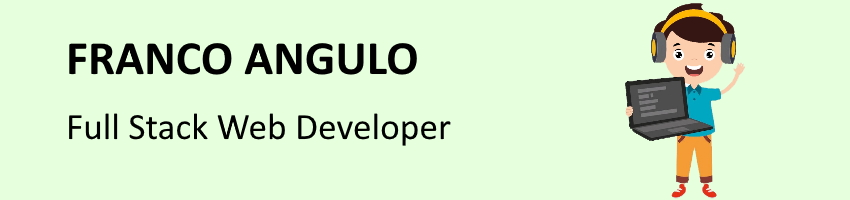

## Hi!👋 Welcome to my profile, I'm Franco 💻

I've always loved programming, especially web-oriented programming, and I've always been researching and learning on my own. That is why I decided to start my career as Full Stack Dev at SoyHenry, to gather and consolidate my knowledge and thus be able to work on what I like the most.
I am extremely responsible and committed to my tasks, always with a good predisposition and constantly learning. I am also a student of Information Systems Engineering, where I have acquired a very powerful logical reasoning.

- 🔭 I’m currently working on a NFT marketplace, as a group final project 
- 🌱 I’m currently learning solidity and hardhat

## Projects

- **Weather App**: Weather application project in wich I learned to make requests to an API endpoint
- **Pokemon App**: Individual Project where I learned to work with front and back together, combining API requests, a database and a user interface.

Check them in my repos!😁

## Technologies

- ♦ JavaScript - HTML - CSS
- ♦ React - Redux - Thunk
- ♦ NodeJS - ExpressJS
- ♦ Sequelize - PostgreSQL - SQL

## Contact me

✉ francoangulo2001@gmail.com

👔 https://www.linkedin.com/in/franco-angulo/

<!--
**francoa7/francoa7** is a ✨ _special_ ✨ repository because its `README.md` (this file) appears on your GitHub profile.

Here are some ideas to get you started:

- 👯 I’m looking to collaborate on ...
- 🤔 I’m looking for help with ...
- 💬 Ask me about ...
- 📫 How to reach me: ...
- 😄 Pronouns: ...
- ⚡ Fun fact: ...
-->
